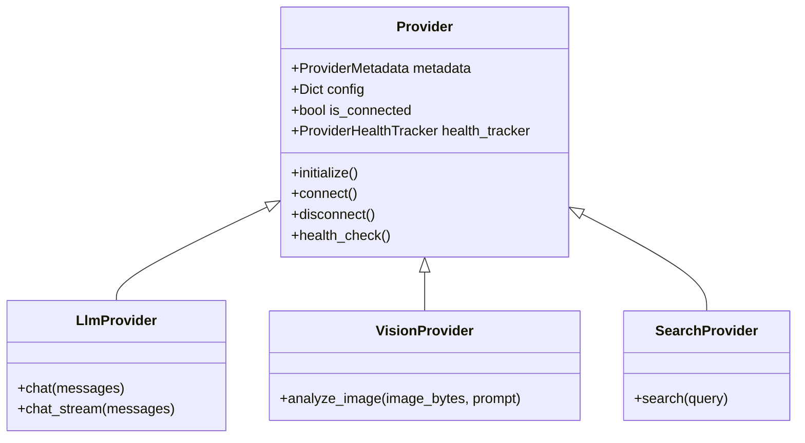
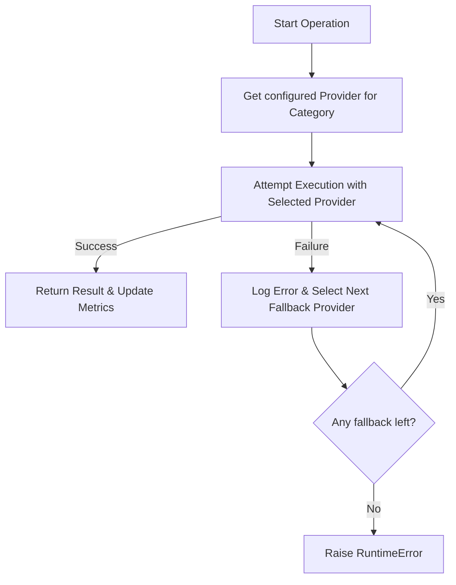
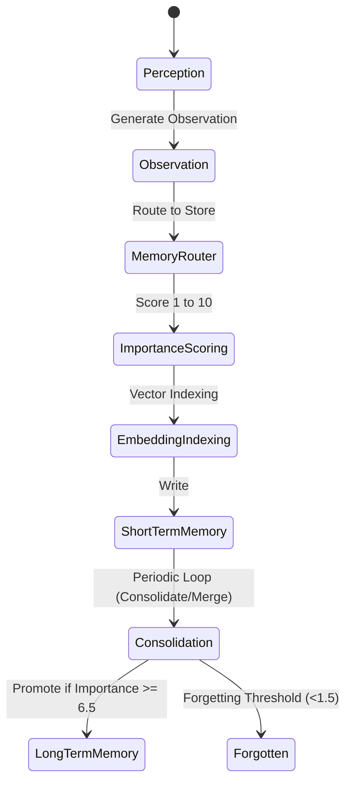
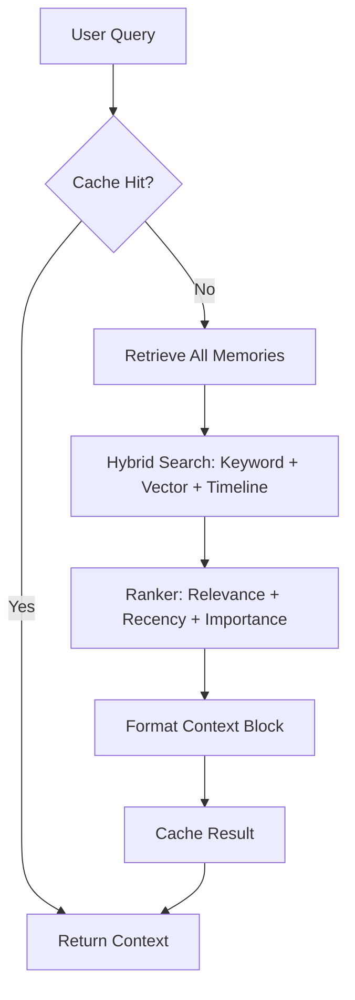
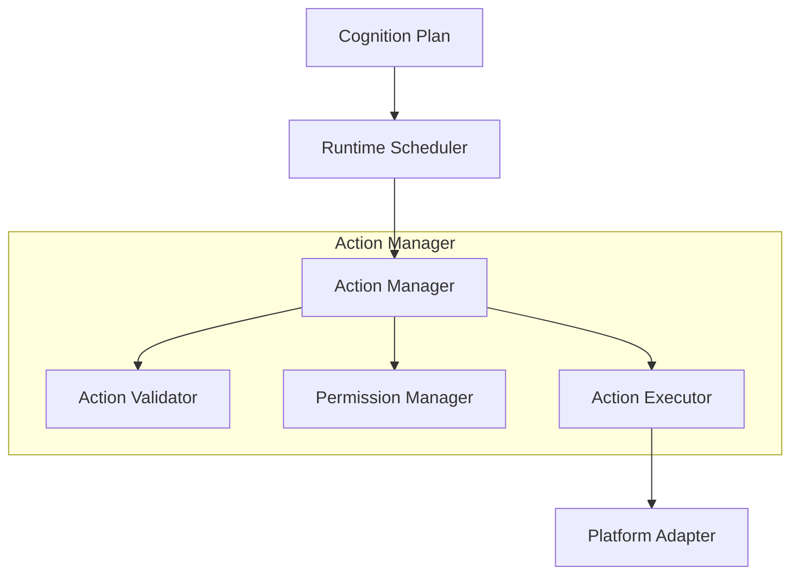
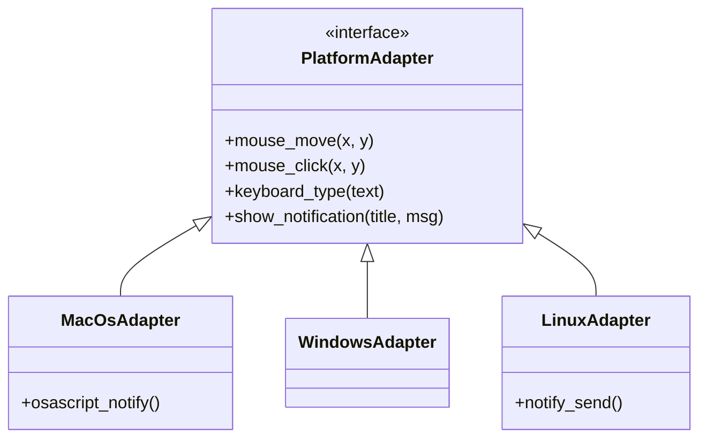
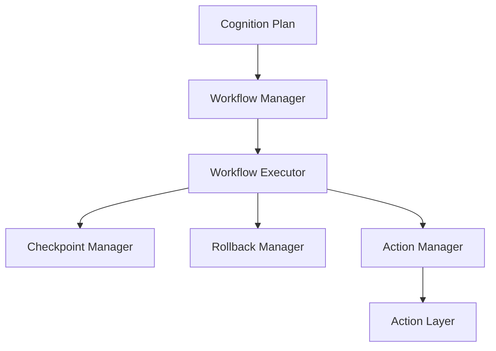
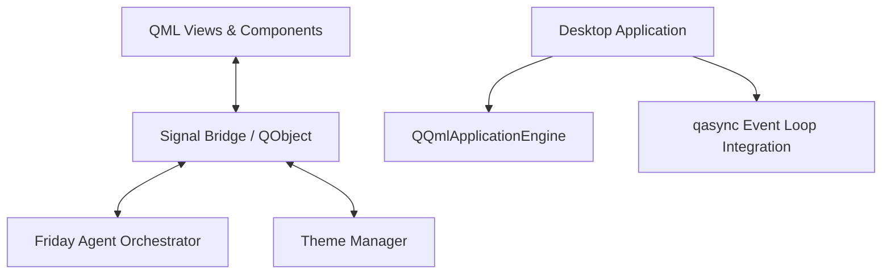
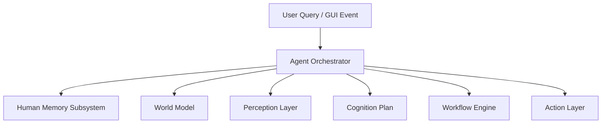
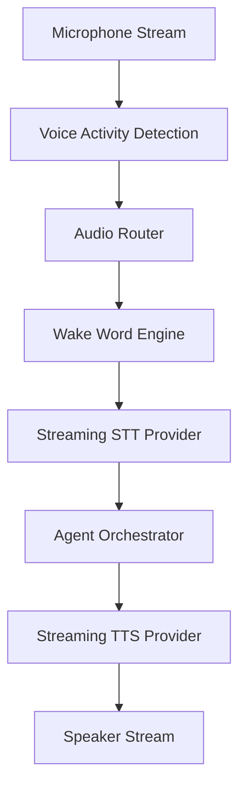

# Architecture Documentation — Project F.R.I.D.A.Y.

F.R.I.D.A.Y. ("Fully Responsive Intelligent Digital Assistant for You") is built on a modular, unified architecture designed for desktop automation, perception, persistent memory, and real-time voice & text interactions.

---

## 1. Provider Architecture

The **Unified Provider Framework** serves as the exclusive layer for external API communications, AI models, database operations, and external search integrations.

All providers inherit from a base `Provider` class:



---

## 2. Selection & Fallback Flow

When an operation is requested (e.g. `LlmProvider.chat`), the `ProviderManager` selects the primary configured provider from `.env` (e.g. `LLM_PROVIDER=openai`). If that provider fails or is unreachable, the system automatically falls back to alternative providers configured in a fallback chain.



---

## 3. Configuration

Every provider is entirely configured via the `.env` file (copied from `.env.example`).
Key configuration variables:
- `LLM_PROVIDER`: Selected model provider (`openai`, `gemini`, `anthropic`, `groq`, `openrouter`, `ollama`)
- `VISION_PROVIDER`: Selected vision model provider (`openai`, `gemini`, `openrouter`, `ollama`)
- `OCR_PROVIDER`: Text extraction provider (`easyocr`, `paddleocr`)
- `EMBEDDING_PROVIDER`: Vector embedding provider (`openai`, `voyage`, `jina`, `cohere`)
- `STT_PROVIDER`: Speech-to-Text provider (`deepgram`, `sarvam`, `whisper`, `azure`)
- `TTS_PROVIDER`: Text-to-Speech provider (`deepgram`, `openai`, `sarvam`, `azure`)

---

## 4. Health & Latency Monitoring

Each provider instance maintains a `ProviderHealthTracker` that tracks:
- **Availability**: Ratio of successful calls to total calls.
- **Latency**: Tracking average and last execution durations in milliseconds.
- **Error Tracking**: Unique error message registration and count.
- **Cost**: Real-time token usage and pricing calculation.

---

## 5. Human Memory System (Hermes Architecture)

The **Human Memory System** supports multiple memory tiers:
- **Working Memory**: Short-term active reasoning context.
- **Short-Term Memory & Episodic Memory**: Observations and dialogue events.
- **Long-Term Memory & Semantic Memory**: Merged, consolidated facts with high importance.
- **Procedural Memory**: Success status and execution results of tools.

### 5.1 Memory Architecture Diagram

```mermaid
flowchart TD
    subgraph Perception Layer
        O[Observations] --> MM[Memory Manager]
    end
    subgraph Memory Manager (Orchestrator)
        MM --> MR[Memory Router]
        MM --> MC[Memory Cache]
        MM --> MS[Memory Search]
    end
    subgraph Storage Adapters
        MR --> SQLite[SQLite Storage]
        MR --> Markdown[Local Markdown Storage]
        MR --> Mem0[Mem0 Vector Storage]
    end
```

### 5.2 Memory Lifecycle



### 5.3 Retrieval Flow



---

## 6. Action Layer

The **Action Layer** executes low-level operating system tasks without planning or reasoning. It supports platform abstraction (macOS, Windows, Linux) and secures sensitive executions through user verification.

### 6.1 Action Layer Diagram



### 6.2 Platform Adapter Diagram



---

## 7. Automation & Workflow Engine

The **Automation & Workflow Engine** (`friday/automation/`) coordinates low-level actions into reliable, resumable, long-running workflows with checkpointing and state rollback.



---

## 8. Desktop GUI Architecture (PySide6 & QML)

The **Desktop Application** (`friday/apps/desktop/`) delivers a modern graphical UI powered by PySide6 and QML:



---

## 9. Agent Orchestrator

The **Friday Agent Orchestrator** (`friday/agent/`) serves as the single unified entry point for every system request.



---

## 10. Voice Conversation System

The **Voice Conversation System** (`friday/voice/`) provides real-time, native spoken interactions directly integrated with the Agent Orchestrator:



### Streaming Architecture
- **Microphone & Speaker Streams**: Background audio threads capturing and playing raw PCM audio bytes asynchronously via `sounddevice`.
- **Voice Session & Conversation Manager**: Maintains conversation turn-taking logic, handling interruptions gracefully.
- **Audio Router**: Resamples inputs to 16kHz Mono and applies noise reduction / threshold filtering.
